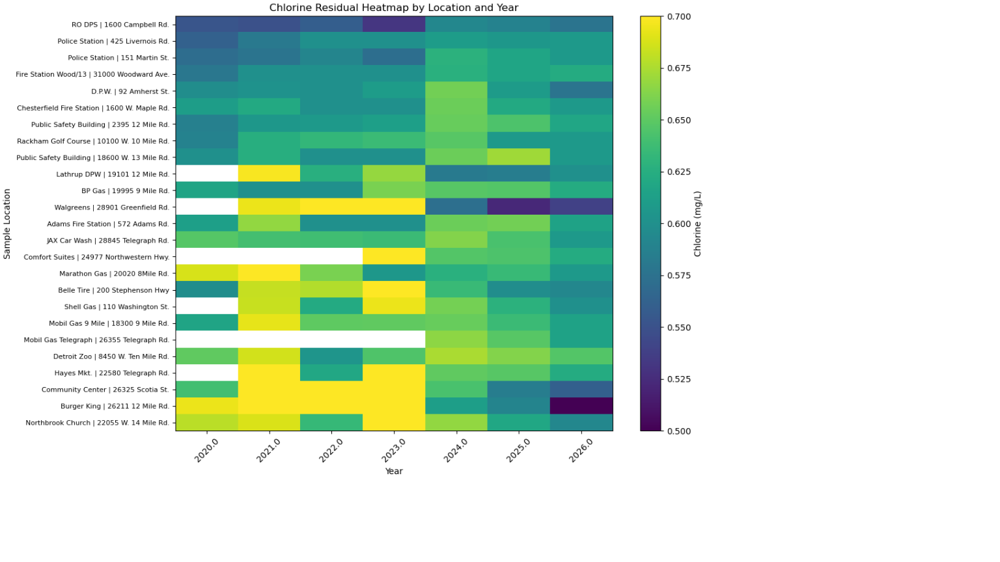

# Chlorine Residual Analysis – Water Distribution System

### Overview

This project analyzes chlorine residual data from a municipal water distribution system serving over 250,000 residents. The objective is to evaluate overall disinfection performance, identify potential risk areas, and develop a data-driven framework for ongoing monitoring.

Chlorine residual is a key indicator of drinking water safety, ensuring that disinfectant levels are maintained throughout the distribution network.

### Objectives

- Assess whether chlorine residuals remain within typical operational targets
- Identify and investigate anomalous low-residual measurements
- Compare performance across sampling locations
- Analyze spatial and temporal patterns in system behavior
- Develop metrics to highlight locations approaching minimum thresholds
  
### Dataset

The dataset consists of multi-year field sampling data, including:

- Sample location and address
- Sampling date
- Chlorine residual (mg/L)

Each location is typically sampled once per week as part of a rotating monitoring schedule.

### Methodology

##### Data Preparation

- Parsed multi-year Excel reports with inconsistent formatting
- Standardized column structures and data types
- Resolved location naming inconsistencies using address-based mapping

##### Data Quality Handling

- Identified near-zero chlorine values unlikely to reflect actual system conditions
- Flagged these observations as data quality anomalies rather than removing them

##### Exploratory Analysis

- Evaluated distribution of chlorine residuals
- Analyzed system-wide trends over time
- Compared performance across locations

##### Visualization

- Time series analysis of system-wide averages
- Heatmap to examine spatial and temporal patterns
- Location-level metrics to identify lower-performing sites

##### Risk Metric

- Calculated the proportion of samples below 0.5 mg/L for each location
- Used this metric to identify sites that more frequently approach the lower operational threshold
  
### Key Findings

- Chlorine residual levels are highly stable across the system
- Most values fall within a narrow operational range (~0.6–0.7 mg/L)
- No evidence of system-wide degradation was observed
- Variability is primarily location-specific, not systemic
- A small number of locations consistently operate near the lower bound, but remain within acceptable limits

### Impact

This analysis demonstrates how operational sampling data can be transformed into actionable insights for monitoring and decision-making. It provides a framework for identifying locations that may require additional attention while confirming overall system reliability.

### Tools
- Python (Pandas, NumPy)
- Matplotlib
- Jupyter Notebook

### Next Steps
- Incorporate additional variables such as temperature or hydraulic factors
- Develop automated monitoring or alerting for low residual thresholds
- Extend analysis into a dashboard for ongoing use

### Summary

The system maintains consistent and reliable chlorine residual levels across both time and location. Observed variability is driven by local conditions rather than system-wide issues, and the analysis framework provides a scalable approach for continued monitoring.
